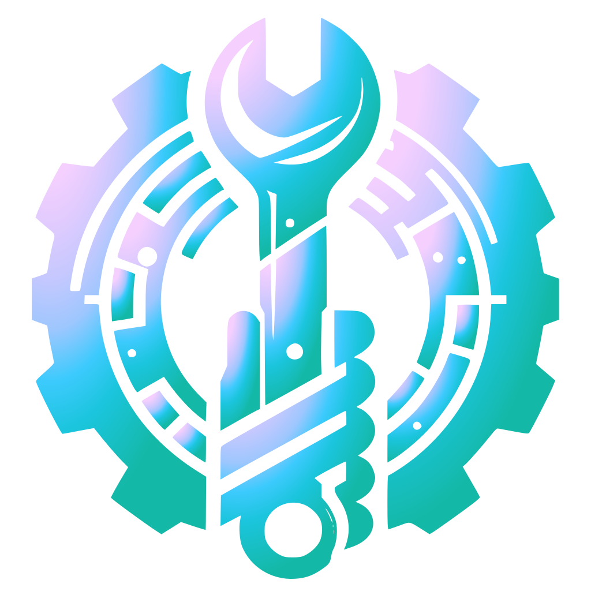

<h1 align="center" style="font-weight: bold;">
  Project ManuTADS
  
</h1>

  
  
  
  
  
  

 <a href="#started">Getting Started</a> • 
  

<b>ManuTADS</b> is a web system developed as the final project for the <b>Web Development II</b> course in the undergraduate program in Systems Analysis and Development at UFPR. It is a website for a fictitious equipment maintenance company, <b>ManuTADS</b>. Through this site, customers can register and request their mechanical repairs, while professionals can view the demands and follow the complete workflow provided by the system.

     <a href="https://github.com/Salgado2004/SRV-WEB2-UFPR-Trabalho-Final">Visit the backend repository</a>

<h2 id="layout">📷 Screenshots</h2>

    

<h2 id="colab">🤝 Collaborators</h2>
<table>
  <tr>
    <td align="center">
      <a href="https://github.com/AlissonGSantos">
         
        
          <b>Alisson Gabriel</b>
        
      </a>
    </td>
    <td align="center">
      <a href="https://github.com/Gabriel-Troni">
         
        
          <b>Gabriel Troni</b>
        
      </a>
    </td>
    <td align="center">
      <a href="https://github.com/Salgado2004">
         
        
          <b>Leonardo Salgado</b>
        
      </a>
    </td>
    <td align="center">
      <a href="https://github.com/matbaaz">
         
        
          <b>Mateus Bazan</b>
        
      </a>
    </td>
    <td align="center">
      <a href="https://github.com/Pedro-H108">
         
        
          <b>Pedro Henrique</b>
        
      </a>
    </td>
    <td align="center">
      <a href="https://github.com/raulbana">
         
        
          <b>Raul Bana</b>
        
      </a>
    </td>
  </tr>
</table>

Special thanks to Professor Dr. Razer A. N. R. Montaño