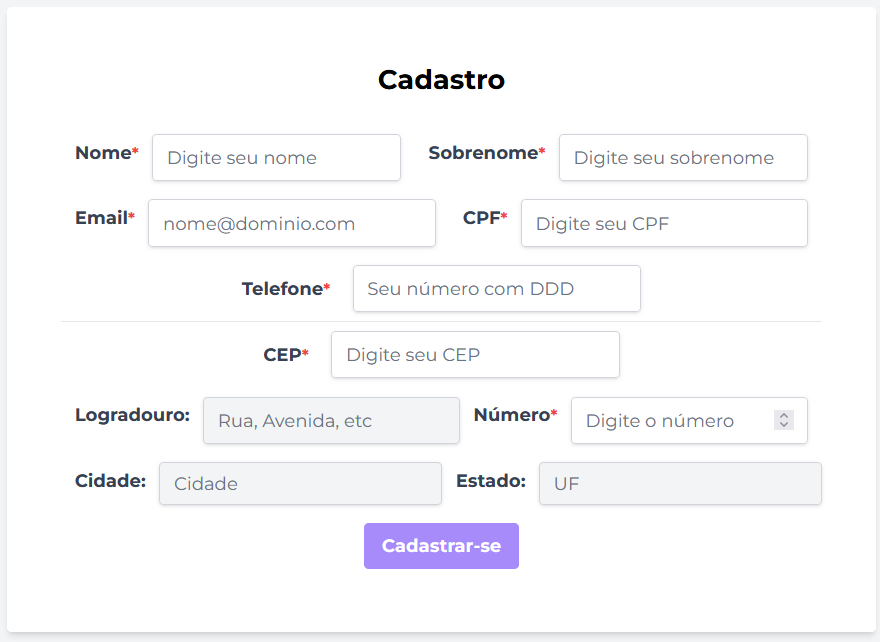
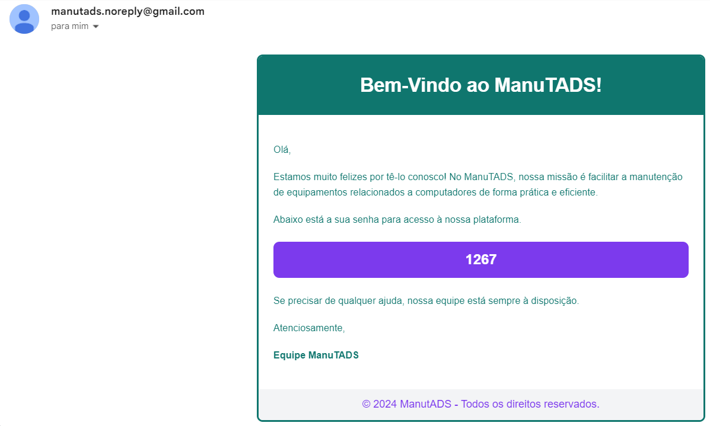
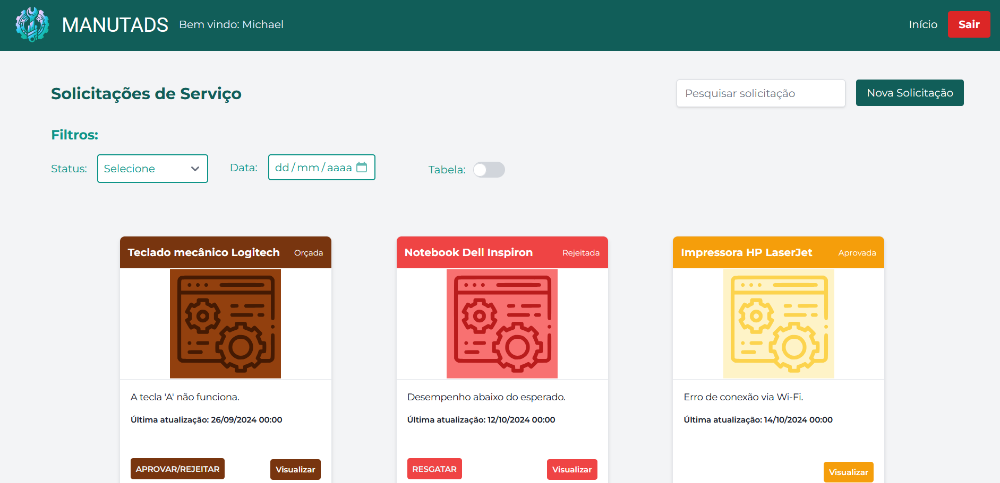
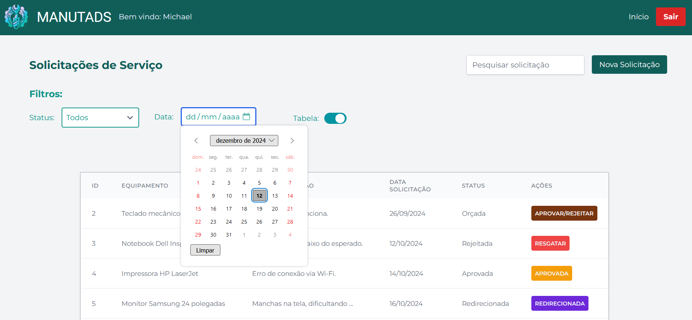
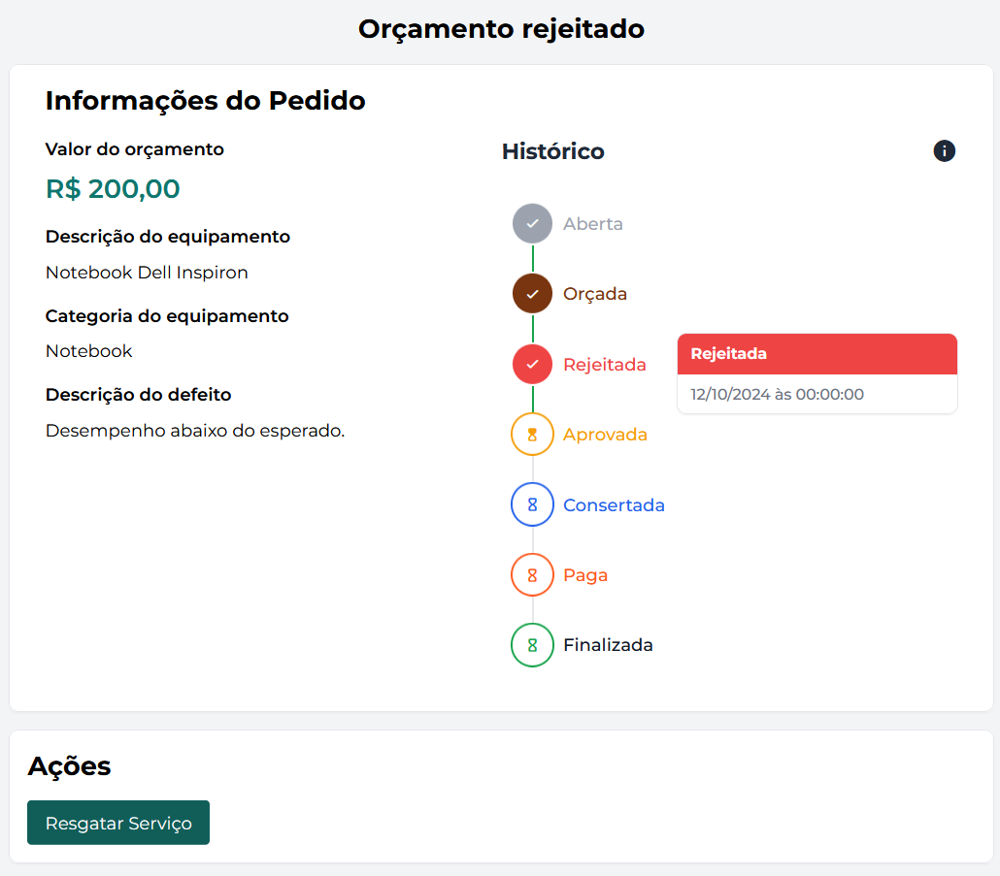
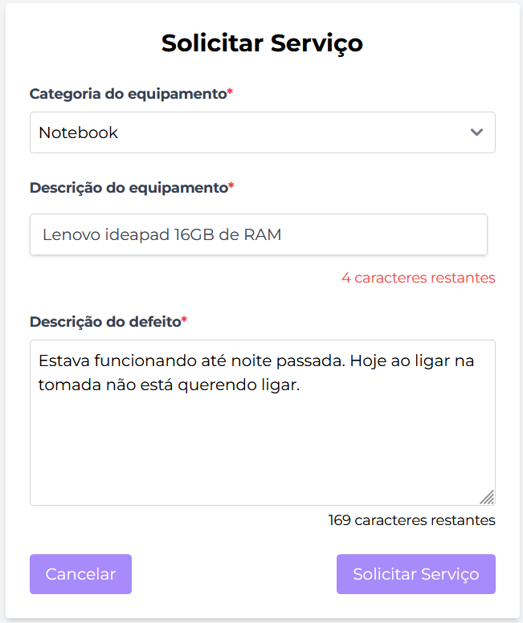
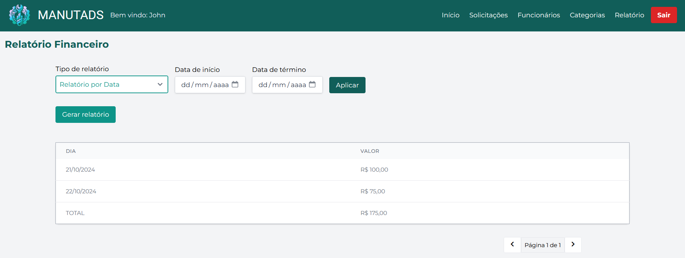
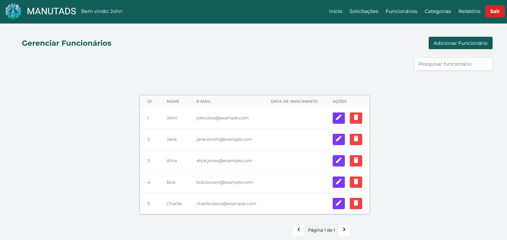

<h1 align="center" style="display: flex;">
  Project ManuTADS
  
</h1>

  
  
  
  
  
  <!---->
  

 

<b>ManuTADS</b> is a web system developed as the final project for the <b>Web Development II</b> course in the undergraduate program in Systems Analysis and Development at UFPR. It is a website for a fictitious equipment maintenance company, <b>ManuTADS</b>. Through this site, customers can request their mechanical repairs, while professionals can view the demands and follow the complete workflow provided by the system.

     <a href="https://github.com/Salgado2004/SRV-WEB2-UFPR-Trabalho-Final">Visit the backend repository</a>

<h2 id="screenshots">📷 Screenshots</h2>

  
  
  
  
  
  
  
  
  
  

<h2 id="collaborators">🤝 Collaborators</h2>
<table>
  <tr>
    <td align="center">
      <a href="https://github.com/AlissonGSantos">
         
          Alisson Gabriel
      </a>
    </td>
    <td align="center">
      <a href="https://github.com/Gabriel-Troni">
         
          Gabriel Troni
      </a>
    </td>
    <td align="center">
      <a href="https://github.com/Salgado2004">
         
          Leo Salgado
      </a>
    </td>
    <td align="center">
      <a href="https://github.com/matbaaz">
         
          Mateus Bazan
      </a>
    </td>
    <td align="center">
      <a href="https://github.com/Pedro-H108">
         
        Pedro Henrique
      </a>
    </td>
    <td align="center">
      <a href="https://github.com/raulbana">
         
         Raul Bana 
      </a>
   </td>
  </tr>
</table>

Special thanks to Professor Dr. Razer A. N. R. Montaño