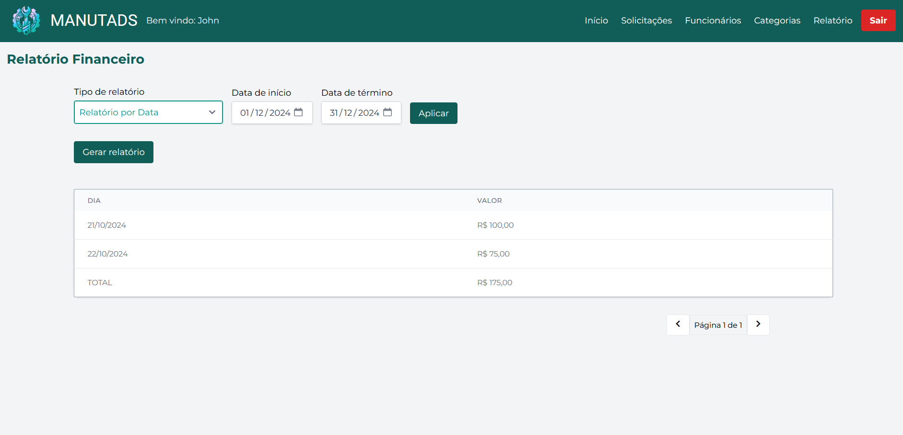

<h1 align="center" style="display: flex;">
  Project ManuTADS
  
</h1>

  
  
  
  
  
  <!---->
  

 

<b>ManuTADS</b> is a web system developed as the final project for the <b>Web Development II</b> course in the undergraduate program in Systems Analysis and Development at UFPR. It is a website for a fictitious equipment maintenance company, <b>ManuTADS</b>. Through this site, customers can request their mechanical repairs, while professionals can view the demands and follow the complete workflow provided by the system.

     <a href="https://github.com/Salgado2004/SRV-WEB2-UFPR-Trabalho-Final" target="_blank">Visit the backend repository</a>

<h2 id="screenshots">📷 Screenshots</h2>

  
  
  <!---->
  
  
  
  
  
  
  

<h2 id="collaborators">🤝 Collaborators</h2>
<!-- contributors -->
<table>
	<tr>
       <td align="center">
            <a href="https://github.com/Salgado2004">
                
                
<strong>Salgado2004</strong>

            </a>
        </td>
       <td align="center">
            <a href="https://github.com/AlissonGSantos">
                
                
<strong>AlissonGSantos</strong>

            </a>
        </td>
       <td align="center">
            <a href="https://github.com/raulbana">
                
                
<strong>raulbana</strong>

            </a>
        </td>
       <td align="center">
            <a href="https://github.com/matbaaz">
                
                
<strong>matbaaz</strong>

            </a>
        </td>
       <td align="center">
            <a href="https://github.com/Gabriel-Troni">
                
                
<strong>Gabriel-Troni</strong>

            </a>
        </td>
       <td align="center">
            <a href="https://github.com/Pedro-H108">
                
                
<strong>Pedro-H108</strong>

            </a>
        </td>
	</tr>
	<tr>
       <td align="center">
            <a href="https://github.com/apps/dependabot">
                
                
<strong>dependabot[bot]</strong>

            </a>
        </td>
	</tr>
</table>
<!-- /contributors -->
Special thanks to Professor Dr. Razer A. N. R. Montaño
